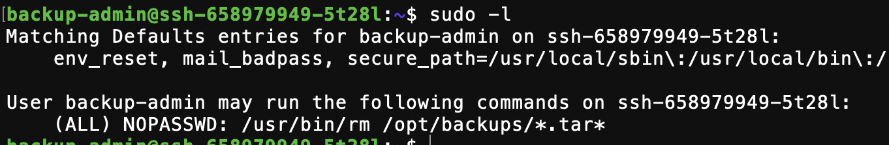
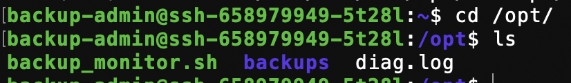
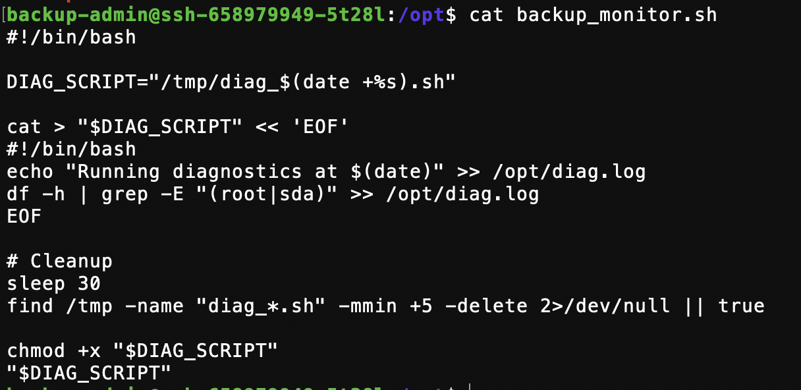
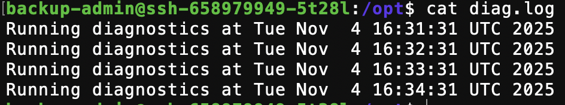
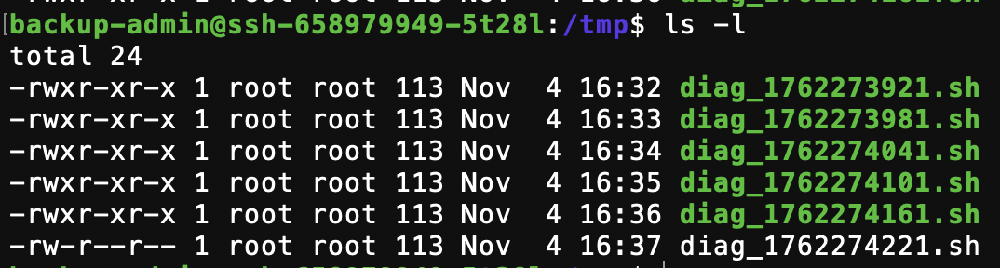
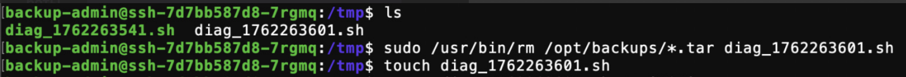
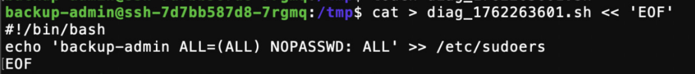
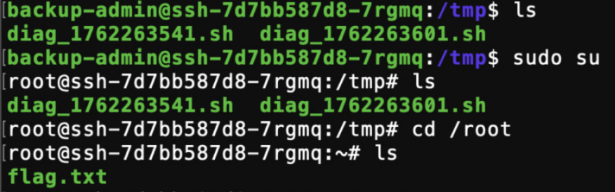

сразу выполняем некоторые команды которые можно сделать (`find / -type f -perm -2000/-4000 2>/dev/null` для поиска suid/guid битов, `sudo -l` для проверки того что мы может исполнить от root). получаем:


из вывода видно что единственное что мы можем делать он имени админа:
```
/usr/bin/rm  /opt/backups/*.tar*
```

интересно. давайте изучать систему

в /opt:


в /opt/backups как ни странно лежит:


давайте изучим backup_monitor.sh


то есть этот скрипт создает какие то скрипты которые проверяют что то в системе (простите, но мне честно было так лень изучать что такое df), ждет 30 секунд и запускает их. ВСЁ ОТ ИМЕНИ РУТА!!!

давайте изучим лог:


то есть backup_monitor.sh каждую минуту создает скрипт и запускает его через 30 секунд. это вполне хорошая возможность для эксплуатации, ведь если подменять код скрипта в эти 30 секунд, получится исполнить что угодно от root

давайте перейдем в /tmp где скрипты создаются


видим эти скрипты, а на последнем еще нет метки исполнения (x на конце), значит эти 30 секунд бездействия скрипта реальны. то есть нам нужно как то подменить этот файл.

вспомним sudo -l , мы можем исполнить выполнить rm (удаление файла) от имени root, но касается это только на
```
/opt/backups/*.tar*
```

(для глупышек - /opt/backups/(любой текст).tar(любой текст))

видите * на конце? это значит что вместо * мы можем написать любой текст, любой длины. то есть мы вполне можем удалить несколько файлов исполнив один вызов sudo!
например мы пишем

```
 /usr/bin/rm  /opt/backups/backup.tar  /tmp/script.sh
 ```

И удаляем одновременно backup.tar и скрипт который должен исполнить root через 30 секунд. так как все скрипты пишутся в /tmp то мы спокойно можем создать новый и подменить код на :
```
#!/bin/bash
echo  'backup-admin ALL=(ALL)  NOPASSWD: ALL' >> /etc/sudoers
```
(исполнение через sudo всех команд без пароля для моего пользователя backup-admin)

то есть все что нам остается это ждать момент когда скрипт создается, и в течение 30 секунд:

- пересоздать его:


- записать в него эксплойт:


потом ждем выполнения скрипта (30 секунд) и проверям, можем ли мы получить права root (sudo su)



sudo su сработал (повышение привилегий до root), значит мы теперь root и можно спокойно прочитать /root/flag.txt
