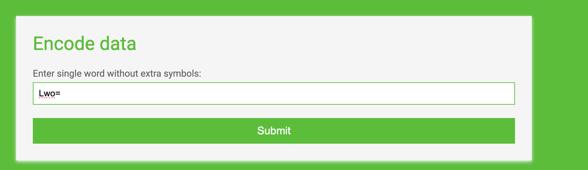
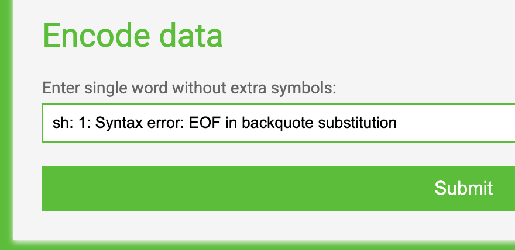
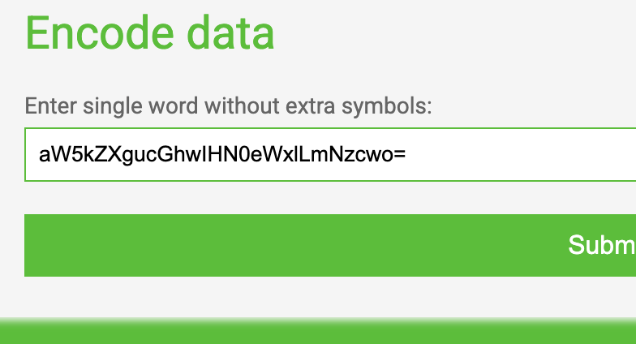
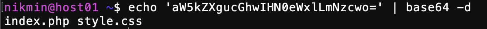
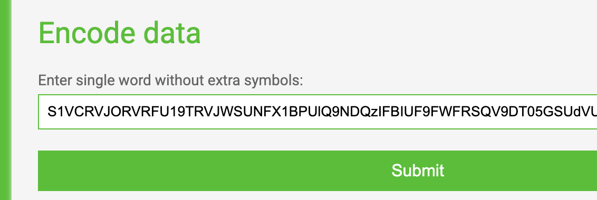
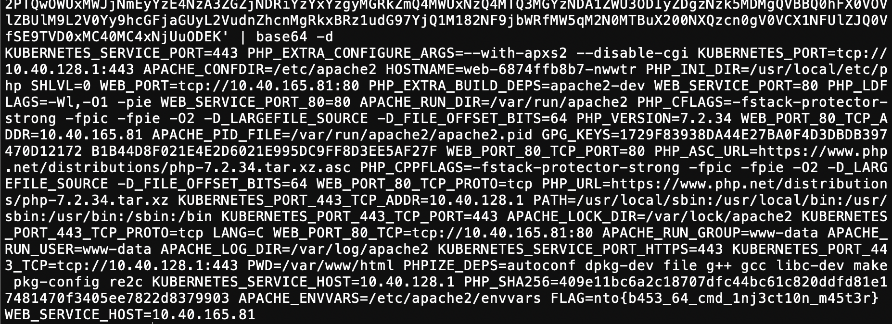

## BasicCMD
перед нами страница которая кодирует текст в Base64. пробуем разные инъекции, но она не позволяет спецсимволы и удаляет их:
например ввод сразу нескольких ./<>\|!@#$%^&*( дал нам только:

(/ если декодировать)

давайте пробовать АБСОЛЮТНО все спецсимволы, потому что никакой другой рабочей страницы у нас нет:

### ~!@#$%^&*()_+-=[]{}|;:'",.<>/?№§`

интересная ошибка, да?

ошибка в знаке `, потому что оказывается он разрешен

 в консоли он используется для исполнения команд внутри другой. например cat \`ls /` сначала получит все файлы в директории / а потом прочитает их через cat (если же вы в /). и напрмиер если на сервере происходит что то типо:

echo input | base64

то мы можем попробовать исполнить что то внутри `` через наш ввод и получить результат исполнения в base64.

если подробнее то при попытке ввода \`ls`:
- сервер согласно моим догадкам по структуре получает на исполнение: echo \`ls` | base64
- сначала он получает все файлы директории через \`ls`
- печатает вывод ls кодируя в base64

давайте попробуем

действительно, мы получили результат ls

так как в поле фильруются почти все спецсимолы работать с директориями не получится, то есть особо ничего не сервере не сделаешь, давайте попробуем получить информацию о его окружении через \`env':

получаем гигантский ответ и при декодировании получем флаг в одной из переменной окружения (как ни странно - FLAG):

задача решена)