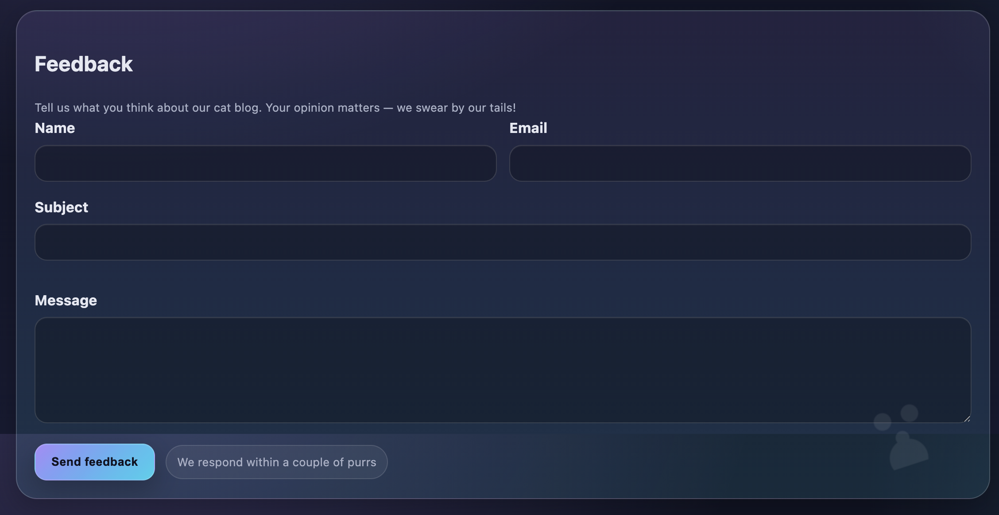
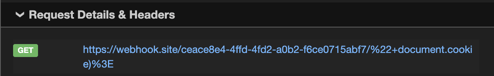
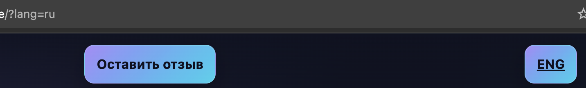
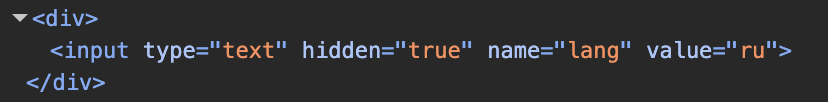
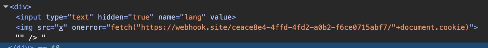
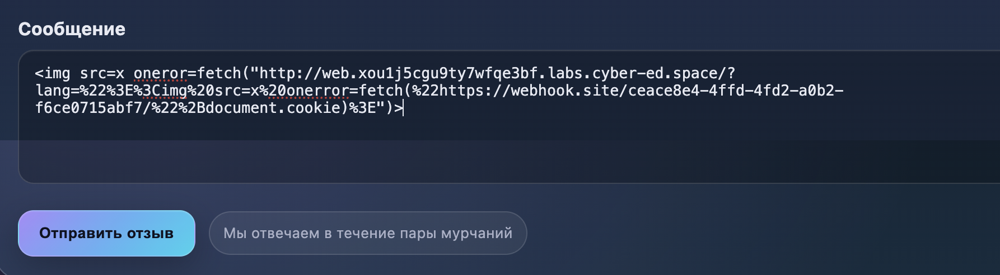
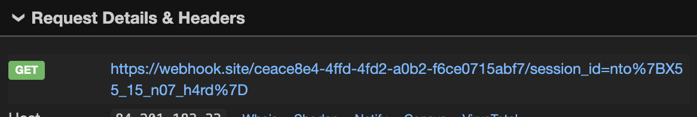

## Задание:

Говорят, администратор этого сайта очень ответственный человек, поэтому часто проверяет, что пользователи пишут в форме обратной связи. Разве может что-то пойти не так?


из задания пока что ничего непонятно, давайте смотреть на страницу. есть поле обратной свзяи

так как данных никаких нет, остаётся только гадать об уязвимости, и пытаясь эксплуатировать XSS, узнаем, что поле message в форме - уязвимо

```коротко про XSS -  уязвимость веб-сайтов, при которой злоумышленник внедряет вредоносный скрипт на страницу, доверенную пользователю. Когда пользователь открывает страницу, его браузер выполняет этот код, что может привести к краже личных данных (гугл в помощь)```

в задании сказано про то что админ читает фидбек. попробуем отослать в message стандартный эксплойт XSS чтобы украсть Cookie админа: 
` (в fetch - условно мой сервер)`

получаем:


то есть почему то сервер обработал только fetch("адрес" и закрыл его после ".

стоит изучить страницу подробнее.

у нас есть параметр lang который меняет язык страницы, надо его изучить


зачем то он добавлен в разметку страницы:


давайте попробуем изменить значение lang для исполнения JS скрипта на странице. для это закроем параметр через "> (то есть структура разметки станет: \<value=""> ), и добавим тег \<script>alert(1)\</script>:

и действительно мой скрипт выполнился


у нас появился новый вектор для атаки.

на данный момент мы имеем:
- уязвимое к XSS поле message
- уязвимый к "Сайд-Скриптингу" lang

и так как message не дает нам добавить к fetch cookie-файлы, давайте попробуем отправить свои cookie через lang:

` lang="> `

на страницу добавляется новый элемент:

а ко мне приходит моя кука:


и так как сервер не хочет принимать +document.cookie в fetch в message, нужно попробовать отправить в message ссылку на свой же сайт но с параметром lang, который отправляет запрос на мой сервер, то есть если проще, запрос в message такого вида:

(допустим, что сайт задания S1)

` `

собираем такой payload и пробуем: (выглядит страшно но если упрощать он довольно простой)


и ура, мы получаем флаг)
