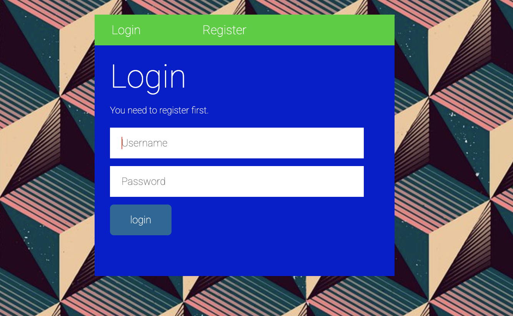
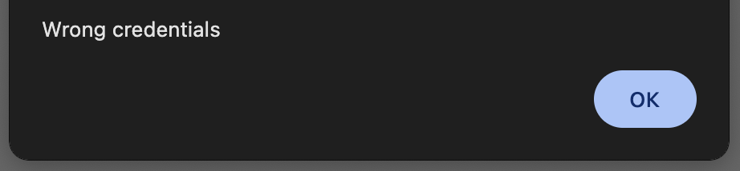
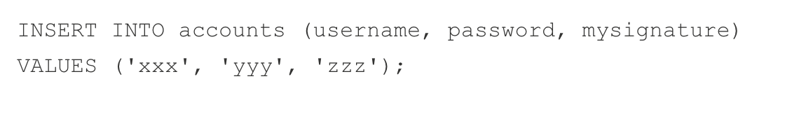
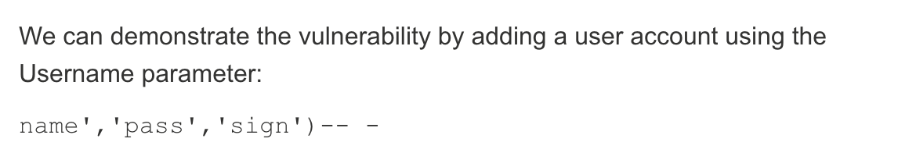

у нас есть красивая страничка с логином, и так как  никаких данных у нас нет, по приколу попробуем логин admin:admin



получем wrong credentials, а так как дело идет с полем логина/регистрации сразу тестим SQLi (SQL Injection)

получим просто 

так как нам не выдало alert() об ошибке неверных кредов, можно сказать что SQLi прошло, но скорее всего в бд случилась какая то ошибка из за нашего запроса. коротко - SQLi работает, но не совсем

изучая дальше можем обратить внимание на то что название задания - INSERTissue, что намекает на существующую InsertSQLi. и почитав статьи можем найти подобные описания:

пример запроса при регистрации:
 

InsertSQL инъекция при регистрации пользователя
 

если примерять её на код запроса будет:

```
INSERT INTO accounts ('name', 'pass', 'sing')-- 

(после -- весь остальной код комментируется, то есть мы смогли подделать запрос и вписать свои данные)
```

то есть в целом можно попробовать эксплуатировать эту инъекцию. но так как /login не очень подходит для вствки значений (что достаточно логично), попробуем пронести инъекию в register.

у нас нет точной структуры БД, поэтому стоит только гадать, например она может быть:
| Username | Password | IsAdmin |
|----------|----------|----------|
| admin    | password   | 1   |
| user    | password   | 0   |


попробуем сделать инъекцию:

`123', '123', 1)--` (то есть мы создаем пользователя 123, с паролем 123 и значением IsAdmin = 1)

получаем:


логинимся и видим флаг, то есть предположение о структуре БД было верным и мой пользователь - админ:
